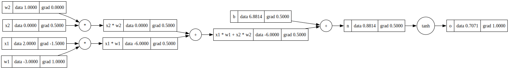

# Micrograd in Rust

A Rust implementation of a minimal automatic differentiation engine inspired by Andrej Karpathy's micrograd. 

This project demonstrates the core concepts behind neural networks and backpropagation from scratch.

## What I Learned

### 1. Automatic Differentiation Fundamentals

This implementation taught me the core principles of automatic differentiation:

- **Forward Pass**: Computing function values while building a computational graph
- **Backward Pass**: Computing gradients by traversing the graph in reverse order
- **Chain Rule**: How gradients flow through composite functions
- **Zero Gradients Before Backward**: Always reset gradients before backpropagation, or your network will be haunted by the ghosts of gradients past! 👻

### 2. Value Design and Computational Graph Tracing

The `Value` struct employs a seemingly complex but highly effective design pattern to solve the unique challenges of automatic differentiation:

#### Why This Indirect Approach?
The design uses a wrapper pattern (often called "newtype" in Rust) with interior mutability to elegantly solve three critical challenges:

1. **Graph Connectivity**: Values need to reference each other in arbitrary ways, including cycles
2. **Shared Access**: Multiple operations need access to the same values simultaneously
3. **Gradient Accumulation**: Values need to be updated during backpropagation while being referenced elsewhere

#### Reference Counting with Interior Mutability
```rust
pub struct Value(Inner);
type Inner = Rc<RefCell<ValueInner>>;
```

- **`Rc<RefCell<T>>`**: Enables mutable access through immutable references - perfect for gradient accumulation
- **Shared Ownership**: Solves the "who owns this value?" problem when values appear in multiple operations
- **Dynamic Borrowing**: Provides a safe way to modify values during backpropagation without complex lifetime annotations

#### Graph Structure Storage
```rust
struct ValueInner {
    data: f64,                              // The actual value
    grad: f64,                              // Gradient (∂L/∂this_value)
    _backward: Option<Box<dyn Fn()>>,       // Backward function for this operation
    op: Option<&'static str>,               // Operation that created this value
    prev: Vec<Value>,                       // Parent nodes in the graph
    label: Option<String>,                  // Optional label for visualization
}
```

Each field serves a critical role in the automatic differentiation system:

- **`data` & `grad`**: Store the forward value and its accumulated gradient, decoupling computation from storage
- **`prev`**: Creates the DAG structure needed for gradient flow, without requiring complex ownership semantics
- **`_backward`**: Stores operation-specific gradient logic as a trait object, enabling a unified backpropagation API
- **`op` & `label`**: Support debugging and visualization without affecting the core algorithm

#### Automatic Graph Construction: The Magic of Operator Overloading

```rust
impl Add for Value {
    fn add(self, rhs: Value) -> Self::Output {
        Value::binary_op_with_backward(
            self, rhs, "+", |a, b| a + b,
            |lhs, rhs, output| {
                Box::new(move || {
                    lhs.set_grad(1.0 * output.grad());  // ∂(a+b)/∂a = 1
                    rhs.set_grad(1.0 * output.grad());  // ∂(a+b)/∂b = 1
                })
            },
        )
    }
}
```

This design leverages Rust's trait system to create a seamless user experience:

1. **Invisible Graph Construction**: Using standard operators (`+`, `*`) automatically builds the computational graph
2. **Gradient Rules as First-Class Citizens**: Each operation encodes its own differentiation rules
3. **Closure Capture**: The backward function captures references to all relevant values, creating a persistent link
4. **Chain Rule Automation**: Gradients are automatically accumulated through the captured structure

### 3. Unified Operation Pattern: Generic Programming at Work

The implementation uses Rust's powerful generic programming capabilities to create a clean abstraction:

```rust
// For unary operations (like tanh)
fn unary_op_with_backward<F, B>(input: Value, op_str: &'static str, op_fn: F, bw_fn: B) -> Value

// For binary operations (like +, *)
fn binary_op_with_backward<F, B>(lhs: Value, rhs: Value, op_str: &'static str, op_fn: F, bw_fn: B) -> Value
```

This higher-order function approach offers significant benefits:

- **Open-Closed Principle**: The system is open for extension but closed for modification
- **Higher-Order Functions**: Operations and their derivatives are passed as generic parameters
- **Type Safety**: The compiler enforces correct usage patterns at compile time
- **DRY Implementation**: Common boilerplate for node creation and graph connection is factored out

### 4. Memory Safety in Rust: Taming the Borrow Checker

This implementation navigates Rust's strict memory safety rules while building a complex graph structure:

- **Ownership Dilemma Solved**: Values can be shared across multiple operations without violating Rust's single-owner rule
- **Safe Graph Traversal**: The graph can be traversed in any direction without lifetime annotation complexity
- **Controlled Mutation**: Gradients can be updated during backpropagation without risking data races or memory corruption
- **Zero-Cost when Possible**: Most operations utilize Rust's zero-cost abstractions, maintaining performance

## Usage Example

### Basic Operations

```rust
use micrograd::engine::Value;

// Create values
let a = Value::new(2.0);
let b = Value::new(3.0);

// Perform operations (automatically builds computational graph)
let c = a.clone() + b.clone();  // c = a + b = 5.0
let d = a.clone() * b.clone();  // d = a * b = 6.0
let e = c.clone() * d.clone();  // e = c * d = 30.0

// Apply activation function
let output = e.tanh();          // output = tanh(30.0)

// Backpropagation
output.backward();     // Compute gradients for all operations in reverse order

// Access computed gradients
println!("da/dL = {}", a.grad());  // Gradient with respect to 'a'
println!("db/dL = {}", b.grad());  // Gradient with respect to 'b'
```

### Neural Network Example

```rust
use micrograd::engine::Value;
use micrograd::trace_graph::draw_dot;

fn main() {
    // Inputs
    let x1 = Value::new(2.0);
    x1.set_label("x1".to_string());
    let x2 = Value::new(0.0);
    x2.set_label("x2".to_string());
    
    // Weights
    let w1 = Value::new(-3.0);
    w1.set_label("w1".to_string());
    let w2 = Value::new(1.0);
    w2.set_label("w2".to_string());
    
    // Bias
    let b = Value::new(6.881373587019543);
    b.set_label("b".to_string());
    
    // Forward pass: linear combination + activation
    let x1w1 = x1.clone() * w1.clone();
    x1w1.set_label("x1 * w1".to_string());
    let x2w2 = x2.clone() * w2.clone();
    x2w2.set_label("x2 * w2".to_string());
    let x1w1x2w2 = x1w1.clone() + x2w2.clone();
    x1w1x2w2.set_label("x1 * w1 + x2 * w2".to_string());
    let n = x1w1x2w2.clone() + b.clone();
    n.set_label("n".to_string());
    let o = n.tanh();
    o.set_label("o".to_string());

    // Backward pass
    o.backward();
    
    // All gradients are now computed automatically!
    // Visualize the computational graph
    draw_dot(&output, "./graph.svg");
}
```
#### graph.svg
<p align="center">
  
</p>

### Neural Network API (nn.rs)

The `nn.rs` module provides a simple neural network API, including `Neuron`, `Layer`, and `MLP` (multi-layer perceptron) types. These allow you to build and train small neural networks using the automatic differentiation engine.

#### Example: Build and Train an MLP

```rust
use micrograd::engine::Value;
use micrograd::nn::{MLP, Module};

fn main() {
    // Training data: inputs and targets
    let xs = vec![
        vec![Value::new(2.0), Value::new(3.0), Value::new(-1.0)],
        vec![Value::new(3.0), Value::new(-1.0), Value::new(0.5)],
        vec![Value::new(0.5), Value::new(1.0), Value::new(1.0)],
        vec![Value::new(1.0), Value::new(1.0), Value::new(-1.0)],
    ];
    let ys = vec![
        Value::new(1.0),
        Value::new(-1.0),
        Value::new(-1.0),
        Value::new(1.0),
    ];

    // Create a 3-layer MLP: input size 3, hidden layers [4, 4], output size 1
    let mlp = MLP::new(3, vec![4, 4, 1]);

    let epochs = 20;
    let lr = 0.01;
    for i in 0..epochs {
        // Forward pass
        let y_pred = xs.iter().flat_map(|x| mlp.forward(x)).collect::<Vec<_>>();
        // Compute loss (mean squared error)
        let loss = ys.iter().zip(y_pred.iter())
            .map(|(y, y_hat)| (y.clone() - y_hat.clone()).powi(2))
            .reduce(|acc, x| acc + x)
            .unwrap();
        // Zero gradients
        mlp.zero_grad();
        // Backward pass
        loss.backward();
        // Update parameters
        for param in mlp.parameters() {
            let new_data = param.data() - lr * param.grad();
            param.set_data(new_data);
        }
        println!("Epoch {}/{}: Loss = {:.3}", i + 1, epochs, loss.data());
    }
    println!("Training complete.");
}
```

#### API Overview

- `Neuron::new(nin)`: Create a neuron with `nin` inputs
- `Layer::new(nin, nout)`: Create a layer with `nout` neurons, each with `nin` inputs
- `MLP::new(nin, nouts)`: Create a multi-layer perceptron with input size `nin` and layer sizes `nouts`
- `forward(&self, x: &[Value])`: Forward pass for neuron/layer/MLP
- `parameters(&self)`: Get all trainable parameters (weights and biases)
- `zero_grad(&self)`: Reset gradients to zero before backpropagation

This API makes it easy to build, train, and experiment with small neural networks in pure Rust.


## Running the Code

```bash
# Run the example
cargo run

# Run tests
cargo test

# This will generate a computational graph visualization at ./graph.svg
```

## Key Insights from Building an AutoDiff Engine

1. **Computational Graphs as Living Structures**: Graphs aren't just static diagrams but dynamic data structures that both record computation history and orchestrate gradient flow

2. **The Chain Rule Incarnate**: Automatic differentiation is the chain rule brought to life through code - a beautiful fusion of calculus and computer science

3. **Type Systems as Guardians**: Rust's ownership model and type system provide mathematical guarantees about memory safety that are particularly valuable in complex graph traversals

4. **Abstraction without Sacrifice**: Well-designed abstractions create user-friendly APIs without sacrificing performance or flexibility, enabling intuitive yet powerful expression of mathematical operations

5. **Visual Thinking in Algorithm Design**: Visualization isn't just for humans - transforming abstract mathematical concepts into concrete visual structures helps reveal algorithmic patterns and debugging opportunities

This implementation serves as a bridge between theoretical understanding and practical implementation, revealing how modern deep learning frameworks like PyTorch and TensorFlow manage to provide both convenience and performance under the hood.