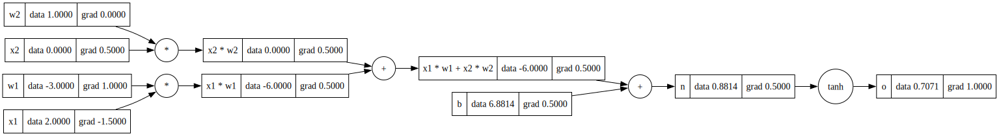

# Micrograd in Rust

A Rust implementation of a minimal automatic differentiation engine inspired by Andrej Karpathy's micrograd. This project demonstrates the core concepts behind neural networks and backpropagation from scratch.

## What I Learned

### 1. Automatic Differentiation Fundamentals

This implementation taught me the core principles of automatic differentiation:

- **Forward Pass**: Computing function values while building a computational graph
- **Backward Pass**: Computing gradients by traversing the graph in reverse order
- **Chain Rule**: How gradients flow through composite functions

### 2. Value Design and Computational Graph Tracing

The `Value` struct is designed to enable automatic computational graph tracing through several key design decisions:

#### Reference Counting with Interior Mutability
```rust
pub struct Value(Inner);
type Inner = Rc<RefCell<ValueInner>>;
```

- **`Rc<RefCell<T>>`**: Allows multiple references to the same value with runtime borrowing
- **Shared Ownership**: Multiple nodes can reference the same value in the graph
- **Mutability**: Gradients can be updated during backpropagation

#### Graph Structure Storage
```rust
struct ValueInner {
    data: f64,                              // The actual value
    grad: f64,                              // Gradient (∂L/∂this_value)
    _backward: Option<Box<dyn Fn()>>,       // Backward function for this operation
    op: Option<&'static str>,               // Operation that created this value
    prev: Vec<Value>,                       // Parent nodes in the graph
    label: Option<String>,                  // Optional label for visualization
}
```

Each `Value` stores:
- **`prev`**: References to parent nodes, forming the computational graph
- **`op`**: The operation name for visualization and debugging
- **`_backward`**: A closure that computes gradients for parent nodes

#### Automatic Graph Construction
```rust
impl Add for Value {
    fn add(self, rhs: Value) -> Self::Output {
        Value::binary_op_with_backward(
            self, rhs, "+", |a, b| a + b,
            |lhs, rhs, output| {
                Box::new(move || {
                    lhs.set_grad(1.0 * output.grad());  // ∂(a+b)/∂a = 1
                    rhs.set_grad(1.0 * output.grad());  // ∂(a+b)/∂b = 1
                })
            },
        )
    }
}
```

When operations are performed:
1. **New node creation**: A new `Value` is created with the result
2. **Parent linking**: The new node stores references to its inputs in `prev`
3. **Backward function**: A closure is stored that knows how to compute gradients

### 3. Unified Operation Pattern

I refactored the code to use a consistent pattern for all operations:

```rust
// For unary operations (like tanh)
fn unary_op_with_backward<F, B>(input: Value, op_str: &'static str, op_fn: F, bw_fn: B) -> Value

// For binary operations (like +, *)
fn binary_op_with_backward<F, B>(lhs: Value, rhs: Value, op_str: &'static str, op_fn: F, bw_fn: B) -> Value
```

This pattern:
- **Eliminates code duplication** between similar operations
- **Standardizes backward function signatures**
- **Makes adding new operations straightforward**

### 4. Memory Safety in Rust

The design handles Rust's ownership system challenges:
- **Shared references** to values in the computational graph
- **Cyclic references** handled safely with `Rc<RefCell<T>>`
- **Runtime borrowing** to mutate gradients during backpropagation

## Usage Example

### Basic Operations

```rust
use micrograd::engine::Value;

// Create values
let a = Value::new(2.0);
let b = Value::new(3.0);

// Perform operations (automatically builds computational graph)
let c = a.clone() + b.clone();  // c = a + b = 5.0
let d = a.clone() * b.clone();  // d = a * b = 6.0
let e = c.clone() * d.clone();  // e = c * d = 30.0

// Apply activation function
let output = e.tanh();          // output = tanh(30.0)

// Backpropagation
output.backward();     // Compute gradients for all operations in reverse order

// Access computed gradients
println!("da/dL = {}", a.grad());  // Gradient with respect to 'a'
println!("db/dL = {}", b.grad());  // Gradient with respect to 'b'
```

### Neural Network Example

```rust
use micrograd::engine::Value;
use micrograd::trace_graph::draw_dot;

fn main() {
    // Inputs
    let x1 = Value::new(2.0);
    x1.set_label("x1".to_string());
    let x2 = Value::new(0.0);
    x2.set_label("x2".to_string());
    
    // Weights
    let w1 = Value::new(-3.0);
    w1.set_label("w1".to_string());
    let w2 = Value::new(1.0);
    w2.set_label("w2".to_string());
    
    // Bias
    let b = Value::new(6.881373587019543);
    b.set_label("b".to_string());
    
    // Forward pass: linear combination + activation
    let x1w1 = x1.clone() * w1.clone();
    x1w1.set_label("x1 * w1".to_string());
    let x2w2 = x2.clone() * w2.clone();
    x2w2.set_label("x2 * w2".to_string());
    let x1w1x2w2 = x1w1.clone() + x2w2.clone();
    x1w1x2w2.set_label("x1 * w1 + x2 * w2".to_string());
    let n = x1w1x2w2.clone() + b.clone();
    n.set_label("n".to_string());
    let o = n.tanh();
    o.set_label("o".to_string());

    // Backward pass
    o.backward();
    
    // All gradients are now computed automatically!
    // Visualize the computational graph
    draw_dot(&output, "./graph.svg");
}
```
#### graph.svg
<p align="center">
  
</p>

### Supported Operations

- **Addition**: `a + b` with gradients `∂/∂a = 1`, `∂/∂b = 1`
- **Multiplication**: `a * b` with gradients `∂/∂a = b`, `∂/∂b = a`
- **Hyperbolic Tangent**: `a.tanh()` with gradient `∂/∂a = 1 - tanh²(a)`

## Running the Code

```bash
# Run the example
cargo run

# Run tests
cargo test

# This will generate a computational graph visualization at ./graph.svg
```

## Key Insights

1. **Computational graphs are just data structures** that record how values depend on each other
2. **Automatic differentiation** is about systematically applying the chain rule
3. **Rust's type system** can enforce memory safety even in complex graph structures
4. **Abstraction** makes it easy to add new operations while maintaining consistency
5. **Visualization** helps understand how gradients flow through the network

This implementation serves as a foundation for understanding how modern deep learning frameworks like PyTorch and TensorFlow work under the hood.
